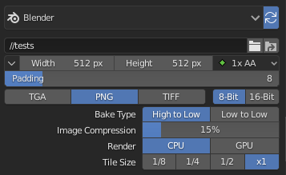
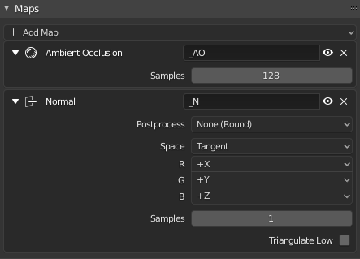

# EZ Baker

An easier alternative to blender's default bake system.

It is designed to automatically match “low” and “high” objects and collections.

## Bakers

Each baker stores the most basic bake options (texture size, output path, padding...). 
Multiple bakers can be created to export with different settings.

## Devices

Each baker can be configured to bake with one of three supported devices:

- Blender: The bakes are done directly in blender using cycles. Although it's the slowest of the three options, it's the only one that works in both linux and windows and its useful for baking bevel shaders.

- [Handplane](https://gumroad.com/l/znpf): The bakes are done in Handplane, a free and fast baking tool.

- [Marmoset Toolbag](https://marmoset.co/toolbag/): The bakes are done in Marmoset Toolbag (Paid software). It's fast and offers plenty of bake passes to choose from.

Each device has its own set of settings to configure.

## Bake Groups

Bake groups are **dynamically** populated based on the objects or collections that are in the scene.
e.g. If you have two objects named "test_high" and "test_low", the option to create the "test" bake group will appear.

Once the bake group is created, any new object that matches the naming conditions will automatically be added to it.

It's used for baking objects that are close together without intersecting issues, or to specify different projection cage settings to each one.

## Projection Cages

Projection cages represent the distance from which the rays are cast when baking. EZ Baker lets you edit the cage displacement value and at the same time shows a visual reprentation of the cage.

## Custom Projection Cages

Custom cages are automatically found by their names.

To use a custom cage, make sure it has the same name as the low object but with "_cage" at the end of its name. e.g. "myobject_low_cage"

(Currently not supported for Marmoset Toolbag)

## Maps

The desired output images are configured in this panel.

Each device (Blender/Handplane/Marmoset Toolbag) has its own set of maps to choose from.

For each map, you can specify the output image suffix and some specific bake options.

Blender:

Handplane:

Marmoset Toolbag:

## Outputs

Once the bake process finishes, all the generated images can be viewed in this panel

